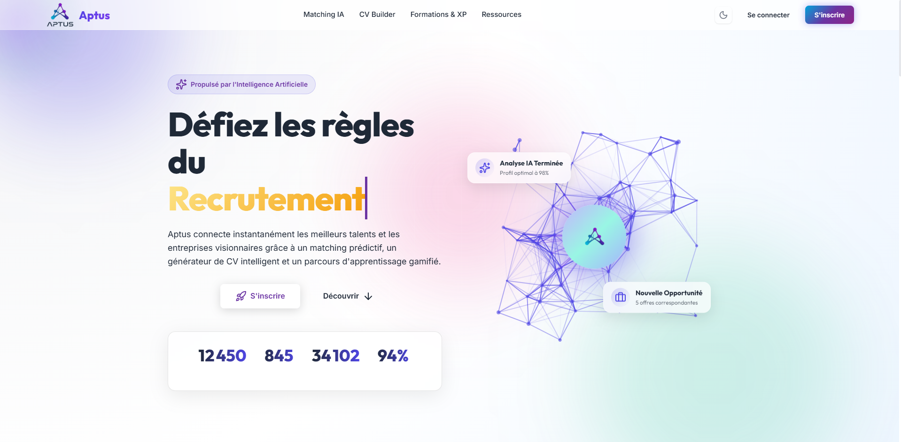
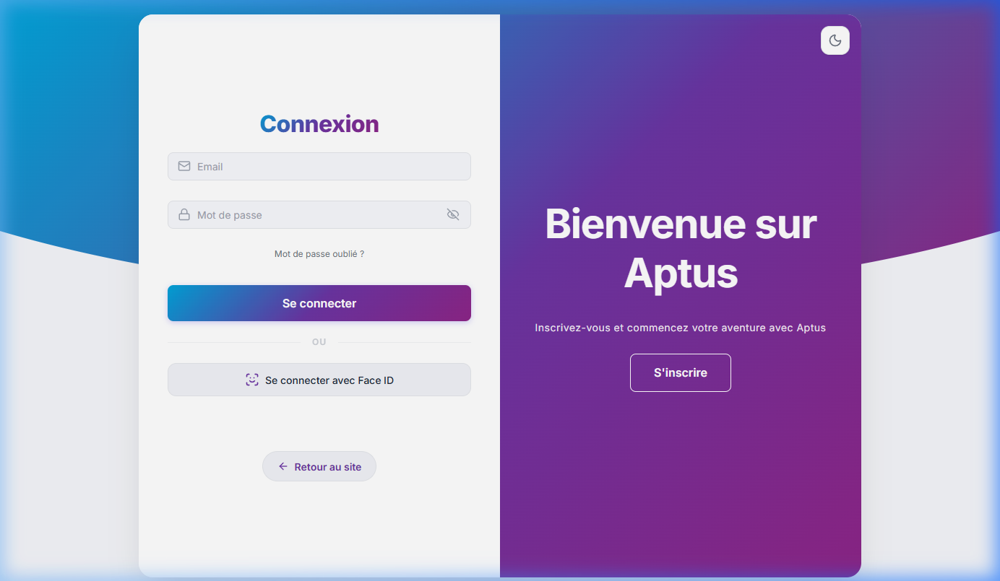
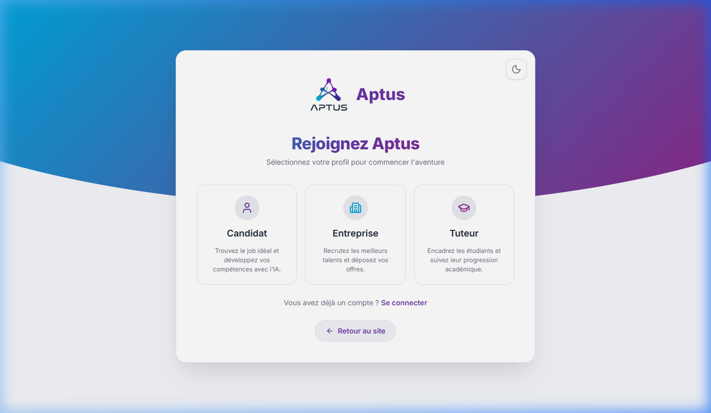

# Demo & Captures d'écran - Aptus

Ce dossier contient des captures d'écran réelles du site web **Aptus** illustrant l'expérience utilisateur des différents modules.

---

## 1. Page d'Accueil (Landing Page)
La page d'accueil présente la plateforme, ses services d'IA intégrés, les fonctionnalités phares (CV Audit, CV Tailoring, Veille du Marché) et les témoignages. Elle dispose d'animations fluides et d'un design moderne et premium.

---

## 2. Page de Connexion (Login Page)
La page de connexion permet aux candidats, recruteurs et administrateurs d'accéder de manière sécurisée à leur espace. Elle dispose également d'une intégration biométrique **Face ID** locale via webcam.

---

## 3. Choix du Profil (Sign-up Choice)
Cette interface moderne permet aux nouveaux utilisateurs de sélectionner leur profil d'inscription spécifique (Candidat, Entreprise ou Tuteur) afin de personnaliser leur parcours sur la plateforme.

